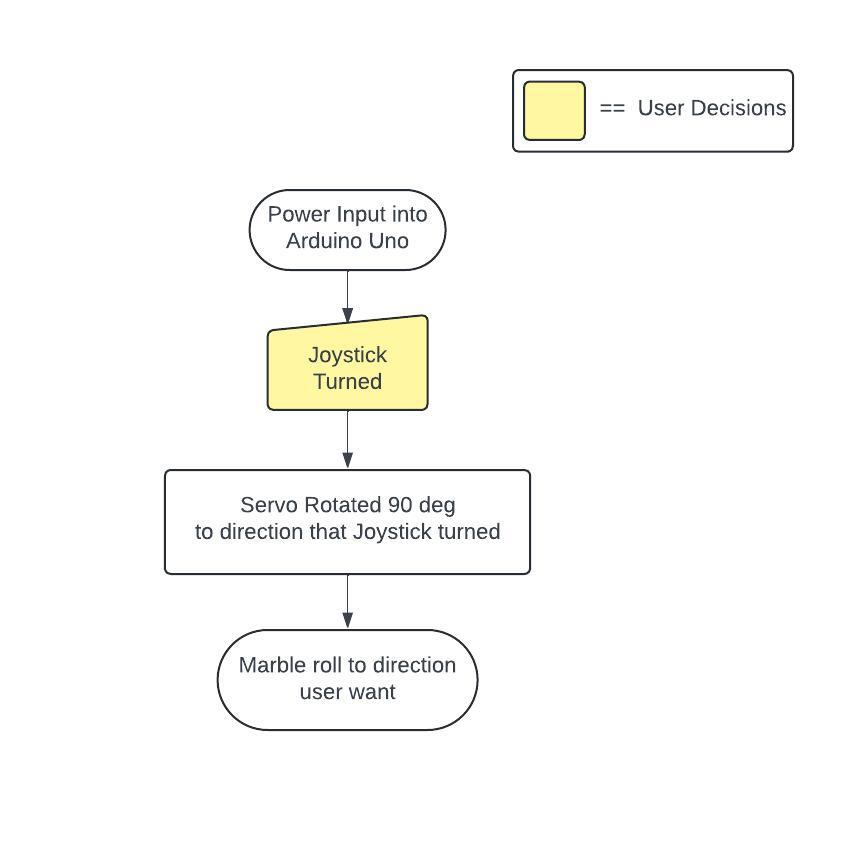

# Controllable-Marble-Maze

### What is Controllable-Marble-Maze?
**Controllable-Marble-Maze** is the maze for marble that is controlled by 2 Servo Motors that get input from the Joystick. Objective of this game is to make marble to the otherside. Also this project was created in a computer and robotics class for "Sci on the MOVE" or science week of grade 10, semester 2. 
   
**เขาวงกตลูกเหล็กแบบควบคุมได้** เป็นเขาวงกตลูกแก้วที่ควบคุมด้วย Servo Motor 2 ตัวที่รับค่าจาก Joystick ส่วนเป้าหมายของเกมนี้คือการทำให้ลูกเหล็กไปสู่อีกฝั่งนึงให้ได้ นอกจากนี้โปรเจ็กต์นี้ยังสร้างขึ้นในชั้นเรียนคอมพิวเตอร์และหุ่นยนต์สำหรับ "Sci on The MOVE" หรือ "สัปดาห์วิทยาศาสตร์ ของชั้นมัธยมศึกษาปีที่ 4 ภาคเรียนที่ 2
 
 
 
### Method
There are 2 Servo Motors that are locked in 90 degrees on only 2 sides of the maze, after Joystick is used, Servo Motor will rotate 90 degrees in the direction it gets and have ability for turning in 4 direction.
   
โดยที่มี Servo Motor 2 ตัวที่ถูกล็อกไว้ที่ 90 องศาบน 2 ด้านของเขาวงกต     หลังจากใช้ Joystick Servo Motor จะหมุน 90 องศาในทิศทางที่มันได้รับค่ามาซึ่งสามารถหมุนได้ 4 ทิศทางด้วยกัน
 
 
 
### Component List
- Servo Motor 2 pcs
- Joystick 1 pcs
- Marble 1 pcs 
- Arduino Uno

### Used Language/Tools

  &nbsp;
  &nbsp;
  

### Flowchart 

  

   

   

### Demo Video

https://github.com/user-attachments/assets/dd9ff795-f9ff-48f7-81bc-8f0f7eaf2d5e

If you want a longer duration of video or video is unavailable, I have also uploaded a video on YouTube, and the link is provided below. 
[Testing Preview Here](https://youtube.com/shorts/Df4pVayRqeQ?feature=share)
