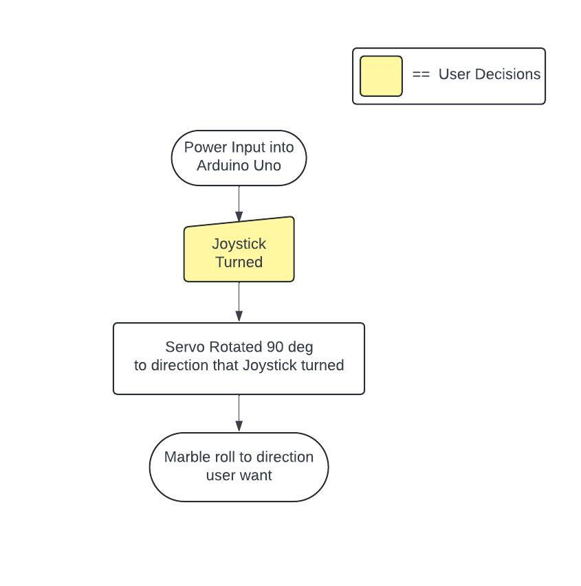

# 🎮 Controllable Marble Maze

  
  

## ✨ Overview

Controllable Marble Maze is an Arduino-based robotics project that transforms a traditional marble maze into an interactive game controlled by a joystick.

The project was developed for **"Sci on the MOVE" (Science Week)** as part of my **Grade 10 Computer and Robotics** course. Players use a joystick to tilt the maze in four directions, guiding a marble from the starting point to the goal while avoiding obstacles.

The project demonstrates the integration of mechanical design, Arduino programming, servo motor control, and analog input processing to create a fun and engaging physical game.

## ⚙️ How It Works

The maze is mounted on a platform driven by **two servo motors**, each responsible for one axis of movement.

A joystick provides analog input to the Arduino, which converts the joystick position into servo movements. By tilting the platform forward, backward, left, or right, players control the marble's movement through the maze.

The objective is simple:

> Guide the marble from the start to the finish without falling into obstacles.

## 🧩 Components

| Component       | Quantity |
| --------------- | -------: |
| Servo Motors    |        2 |
| Joystick Module |        1 |
| Marble          |        1 |
| Arduino Uno     |        1 |

## 🖥 Built With

<table>
<tr align="center">
<td width="120">

</td>

<td width="120">

</td>
</tr>

<tr align="center">
<td>Arduino</td>
<td>C</td>
</tr>
</table>

## 🔄 Control Flow

## 📸 Development Process

<table>
<tr>
<td align="center" width="33%">

 <b>Top View</b>
</td>

<td align="center" width="33%">

 <b>Prototype Testing</b>
</td>

<td align="center" width="33%">

 <b>Final Demonstration</b>
</td>
</tr>
</table>

## 🎥 Demonstration

https://github.com/user-attachments/assets/dd9ff795-f9ff-48f7-81bc-8f0f7eaf2d5e

If the embedded video is unavailable, you can also watch it on YouTube:

**https://youtube.com/shorts/Df4pVayRqeQ?feature=share**

